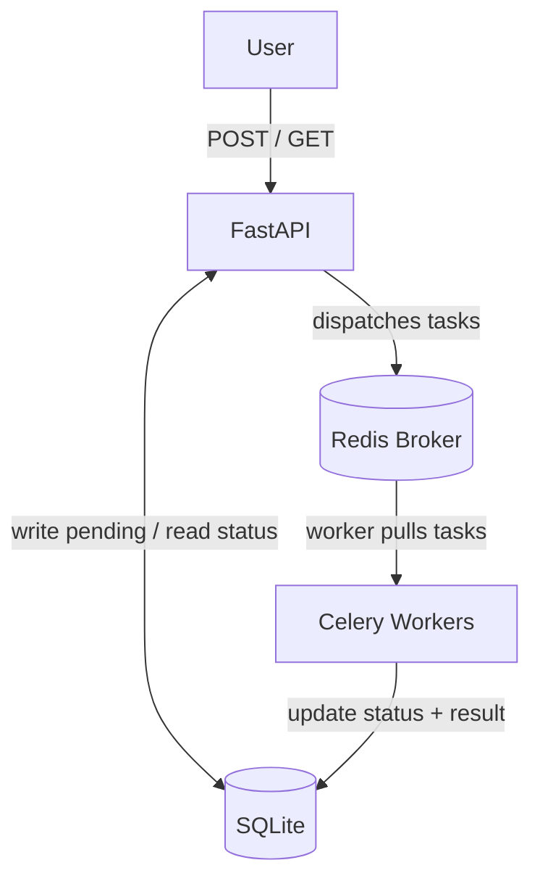

# Async Scraper

Async Scraper is a distributed web scraper built on a task queue using Celery and Redis with HTTP requests and persistent memory. Jobs are submitted over HTTP requests and gets dispatched to a pool of Celery worker processes, which executes them and stores their result in a database. This enables a process to do the fetching and parsing in parallel across multiple processes, processing many jobs concurrently.

## Overview

Async Scraper separates *what work is done* and *how it's scheduled*. An end user submits a job over HTTP and the API stores it in a database. A task gets dispatched to Redis and a pool of Celery worker processes, which runs separately from the API, and pulls tasks from Redis and executes them. After fetching and parsing, the result gets written back to the database, where the end user can retrieve them. Because workers are independent processes, they scale independently of the API. 

## Features
- **Distributed Task Processing** - Celery workers run independently and are separate from the API.
- **Redis** - Is used as a message broker to send tasks to workers. 
- **Error Isolation** - When a job fails, it gets recorded without crashing the program, allowing the worker to still run as well as the others.
- **HTTP Requests** - Can create and upload jobs with `POST` requests and can retrieve specific job with `GET` requests using `FastAPI`.
- **Persistence** - Stores and updates all of the jobs with each request within the database with ORM models using `SQLAlchemy`.
- **Dependency Injection** - Routes receive a database session through FastAPI's dependency injection.
- **Independent Sessions** - Every individual worker can create a session to access the database when needed to update the table. 

## Architecture
When the app runs, the end user can send requests to FastAPI. The request can be a `GET` or `POST` request, each with a different operation. 

The `GET` request retrieves a specific job based on the given job `id` from `job_table` in the database and returns its `status`, `value`, and `error` if it exists. 

As for the `POST` request, the given `JobBase` defined by the base model will be used to create a job row using `JobTable` as the ORM to be stored into the database with the job status as `pending`. An important note to make here is that we will be using the `id` generated by the table and we'll see why in a second. We will define our task to be sent to a queue which is dispatched by the Redis broker. Here, the task will generate another `id` different from the other one, but now this leaves us with two `id`s to work with. From the important note earlier, we will proceed with the `id` generated by the database and pass that into our task. The reason is twofold. First, we can use that `id` to later access to the job table and update the status and store the results. Second, sticking to one `id` prevents us from running into correlation problems. The Celery workers then pulls the tasks from Redis and executes them, updating the status to `running`. 

The workers are separate processes running independently of the API. This means whatever task goes to Redis, one of the workers will pull it and executes it. When the worker is finished and produces a result, the database will get updated with the necessary information. This way, when users make `GET` requests to get the job, they will see that the job has finished running and will see its value and error. The update on the database with the results is handled for each worker. 



## Setup
Requires Python 3.11+ and ensure you have Docker.
```
# Create and activate a virtual environment
python -m venv .venv
source .venv/bin/activate   # Linux/macOS
# .venv\Scripts\activate    # Windows

# Install dependencies
pip install -r requirements.txt
```

## Usage
First, run:
```
docker run -d -p 6379:6379 redis
```
This runs in the background using the port of Redis.

Next, in a new terminal, run:
```
celery -A celery_app worker
```
This creates a pool of workers ready to execute any tasks with Redis.

Finally, with the other terminal, run:
```
python3 main.py
```
Go to `http://localhost:8000/docs` to create and fetch jobs.

Creating Job Sample Input:


Creating Job Sample Output:


Fetching Job Sample Input:


Fetching Job Sample Output:


## Project structure
Relevant files:
```
main.py # Entry point that runs the app.
app.py # FastAPI: Create and fetch jobs through POST and GET requests while updating database.
database.py # SQLAlchemy: JobTable inside of database and get_session for Depends().
tasks.py # This is where the Celery worker executes tasks and updates the results to the database.
handlers.py # Any new and existing job handlers goes here.
context.py # (Not used for now) The Context bundling semaphore, process pool, and HTTP client to get passed to handlers 
job.py # Job defined here.
celery_app.py # Celery app is defined here and used across modules.
```

## Roadmap
- Stage 1: In-memory - DONE
- Stage 2: FastAPI and SQLAlchemy - DONE
- Stage 3: 
    - Phase A: Celery + Redis
        - Phase A-1: Simple Concurrency (one Celery pool) - DONE
        - Phase A-2: Concurrency Optimization (two Celery pools) - DONE
    - Phase B: Postgres + Docker and composing containers - IN PROGRESS
    - Phase C: Host it (AWS) - NOT YET STARTED

## License
MIT.
