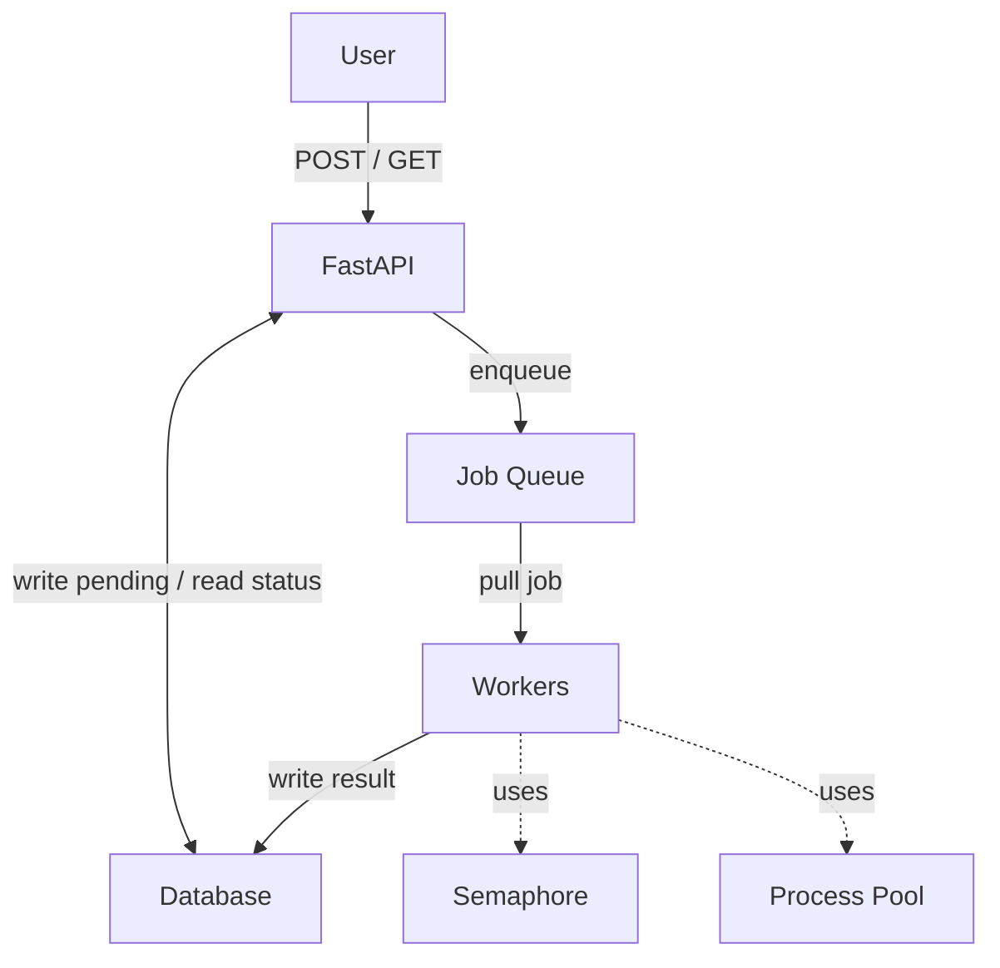
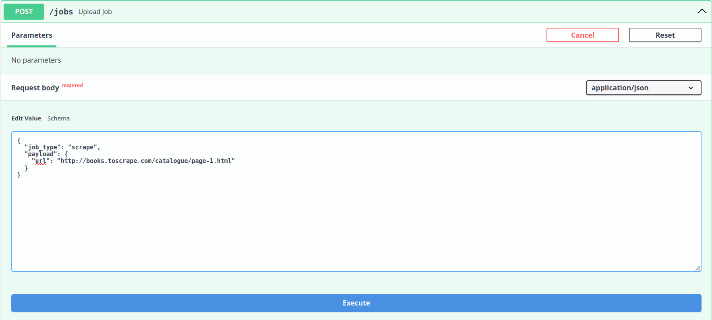
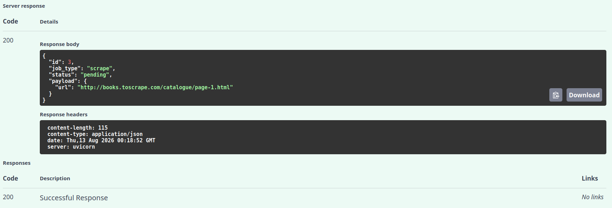
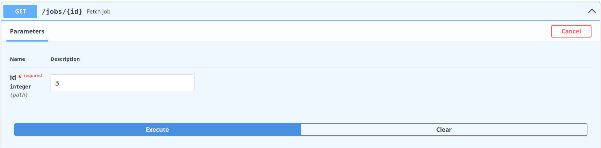
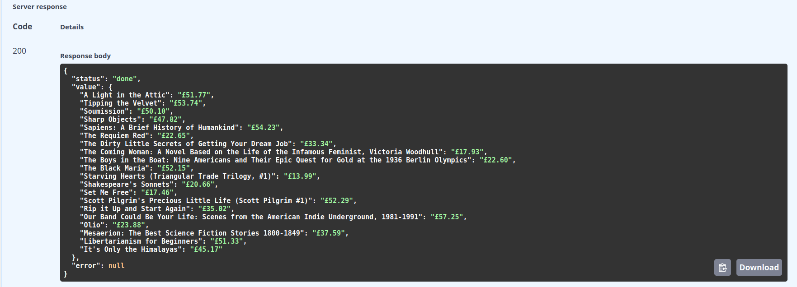

# Async Scraper

Async Scraper is a concurrent scraper built on a job queue with HTTP requests and persistent memory. It fetches URLs asynchronously with bounded concurrency via semaphore, and parses HTML per web page in a separate process. This enables I/O-bound fetching and CPU-bound parsing to run on the concurrency model suited for them. 

## Overview

Async Scraper separates *what work is done* and *how it's scheduled*. Jobs are submitted to a queue where a pool of workers takes them and dispatches each to a handler looked up in a registry, so adding a new job type means writing one decorated function without changing anything in the engine. The scraper itself is one handler, which fetches a web page and passes the HTML parsing to a process pool, keeping the event loop free to handle other fetches. 

## Features
- **Pluggable Job Types** - There may be unrelated job types, so we can use a decorator on any new function without changing the engine.
- **Hybrid Concurrency** - Fetching URLs is I/O-bound handled by coroutines, and parsing HTML is CPU-bound handled by a process pool.
- **Bounded Concurrency** - Limits the number of coroutines that can be executed concurrently at a time, without flooding the server.
- **Error Isolation** - When a job fails, it gets recorded without crashing the program, allowing the worker to still run as well as the others.
- **HTTP Requests** - Can create and upload jobs with `POST` requests and can retrieve specific job with `GET` requests using `FastAPI`.
- **Persistent Memory** - Stores and updates all of the jobs with each request within the database with ORMs instead of in-memory using `SQLAlchemy`.
- **Worker and API Concurrency** - Both FastAPI and workers run when the program starts and stops when the program shutsdown through FastAPI's lifespan.
- **Dependency Injection** - Routes receive a database session through FastAPI's dependency injection.
- **Independent Sessions** - Every individual workers can create a session to access to the database when needed to update the table. 

## Architecture
When the app runs, the end user can send requests to FastAPI. The request can be a `GET` or `POST` request, each with having a different operation. 

The `GET` request defined retrieves a specific job based on the given job `id` from `job_table` in the database and returns its `status`, `value`, and `error` if it exists. 

As for the `POST` request, the given `JobBase` defined by the base model will be used to create a job row using `JobTable` as the ORM to be stored into the database, and will be used to create a `Job` to enqueue onto the job queue. The reason why we create a job row and a `Job` is because the job row automatically generates an unique key which we can plug that into the `Job` we create and store that inside the database for later retrieval. Its `id`, `job_type`, `status` (initially as `pending`), and `payload` will be returned. 

As the app is running, the workers are also active. This means whatever goes onto the job queue, one of the workers will get one job and dispatches its handler to execute its I/O-bound task with a bounded semaphore and CPU-bound task with a process pool. 

When the worker is finished and produces a result, the database will get updated with the necessary information. This way, when users make `GET` requests to get the job, they will see that the job has finished running and will see its value and error. The update on the database with the results is handled for each worker. 

The app and the workers will shutdown once the user ends the program, which frees all of the resources. 



## Setup
Requires Python 3.11+.
```
# Create and activate a virtual environment
python -m venv .venv
source .venv/bin/activate   # Linux/macOS
# .venv\Scripts\activate    # Windows

# Install dependencies
pip install -r requirements.txt
```

## Usage
Run:
```
python3 main.py
```

Creating Job Sample Input:


Creating Job Sample Output:


Fetching Job Sample Input:


Fetching Job Sample Output:


## Project structure
Relevant files:
```
main.py # Entry point that runs the app.
app.py # FastAPI: create and fetch jobs through POST and GET requests while updating database, the engine lives here now.
database.py # SQLAlchemy: JobTable inside of database and get_session for Depends().
worker.py # This is where the worker executes using the dispatched handler and updates the results to the database.
registry.py # @register decorator and job handler dispatch table.
handlers.py # Any new and existing job handlers goes here.
context.py # The Context bundling semaphore, process pool, and HTTP client to get passed to handlers.
job.py # Job defined here.
```

## Roadmap
- Stage 1: In-memory - DONE
- Stage 2: FastAPI and SQLAlchemy - DONE
- Stage 3: Redis, Docker, and AWS - IN PROGRESS

## License
MIT.
